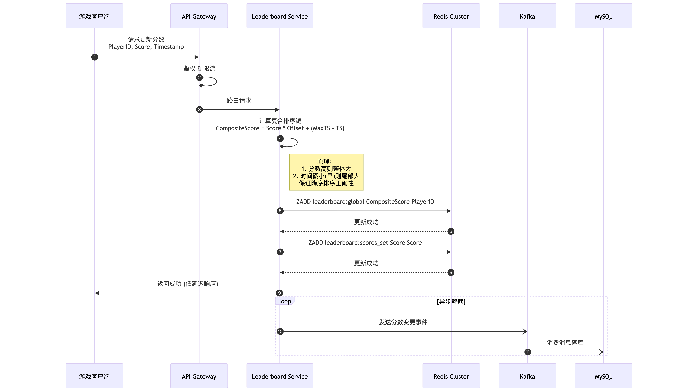
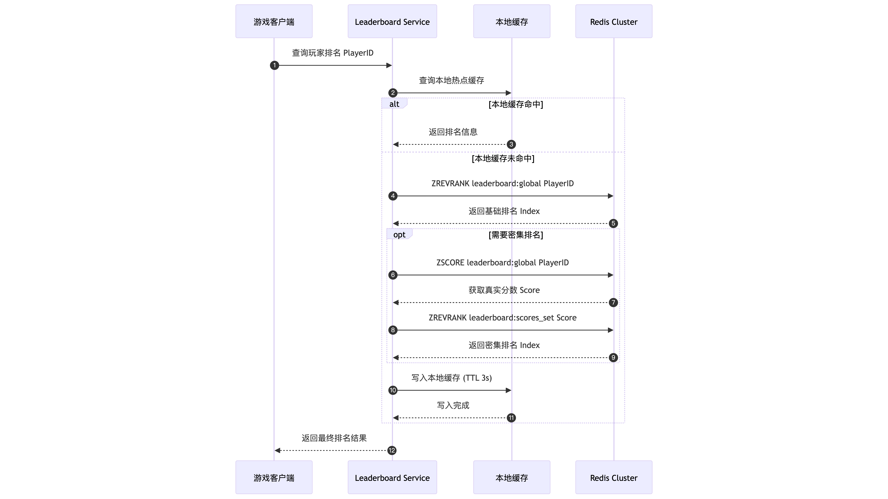
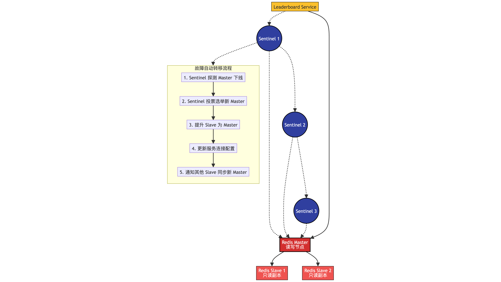

# Go Game Leaderboard

一个高性能的游戏排行榜系统，支持百万级玩家的实时排名查询和更新。

## 服务架构设计

### 1. 核心业务流程 - 更新分数
这张图展示了如何保证“分数相同，先到先得”的排序逻辑，以及如何通过异步队列保证数据最终一致性。

### 2. 核心业务流程 - 查询排名
这张图展示了多级缓存策略（本地缓存 -> Redis），以及密集排名的计算方法。

### 3. Redis 可靠性架构设计
这张图展示了如何通过哨兵模式实现故障自动转移，满足 7*24 小时运行的要求。

### 4. 缓存策略
```
┌─────────────────────────────────────────────────────────────────┐
│                      多级缓存架构                                │
└─────────────────────────────────────────────────────────────────┘

┌─────────────────────────────────────────────────────────────┐
│  L1: 本地缓存 (进程内缓存)                                  │
├─────────────────────────────────────────────────────────────┤
│  ┌────────────┐  ┌────────────┐  ┌────────────┐          │
│  │  Instance1 │  │  Instance2 │  │  Instance3 │          │
│  │  LocalCache│  │  LocalCache│  │  LocalCache│          │
│  │  (热点数据) │  │  (热点数据) │  │  (热点数据) │          │
│  └────────────┘  └────────────┘  └────────────┘          │
│                                                             │
│  缓存内容：                                                 │
│  - Top 100 排行榜 (3秒过期)                                │
│  - 热门玩家信息 (1分钟过期)                                 │
│                                                             │
│  缓存淘汰策略：LRU                                          │
│  容量限制：10,000 条                                        │
└─────────────────────────────────────────────────────────────┘
                            ↓
┌─────────────────────────────────────────────────────────────┐
│  L2: 分布式缓存                               │
├─────────────────────────────────────────────────────────────┤
│  ┌────────────┐  ┌────────────┐  ┌────────────┐          │
│  │   Redis    │  │   Redis    │  │   Redis    │          │
│  │  Master 1  │  │  Master 2  │  │  Master 3  │          │
│  └────────────┘  └────────────┘  └────────────┘          │
│                                                             │
│  数据结构：                                                 │
│  - ZSET: 排名数据 (永久)                                   │
│  - HASH: 玩家详情 (永久)                                   │
│  - STRING: 统计数据 (1小时过期)                             │
└─────────────────────────────────────────────────────────────┘
                            ↓
┌─────────────────────────────────────────────────────────────┐
│  L3: 数据库                                 │
├─────────────────────────────────────────────────────────────┤
│  用途：                                                     │
│  - 数据持久化                                               │
│  - 历史数据查询                                             │
│  - 数据分析报表                                             │
└─────────────────────────────────────────────────────────────┘

缓存更新策略：
1. Write-Through: 写入时同时更新缓存和数据库
2. Write-Behind: 先更新缓存，异步写数据库 (本项目采用)
3. Cache-Aside: 读取时更新缓存

缓存穿透防护：
1. 布隆过滤器：快速判断玩家是否存在
2. 空值缓存：缓存空结果 (短过期时间)
3. 互斥锁：防止缓存击穿
```
### 5. 分片策略
```
┌─────────────────────────────────────────────────────────────────┐
│                      Redis 分片策略                              │
└─────────────────────────────────────────────────────────────────┘

方案一：Redis Cluster (推荐)
┌────────────────────────────────────────────────────────────┐
│  16384 个槽位分配到 3 个 Master 节点                          │
├────────────────────────────────────────────────────────────┤
│  Shard 1: 槽位 0-5461                                      │
│  Shard 2: 槽位 5462-10922                                  │
│  Shard 3: 槽位 10923-16383                                 │
│                                                            │
│  Key 分配规则：                                             │
│  slot = CRC16(key) % 16384                                 │
│                                                            │
│  示例：                                                     │
│  leaderboard:player_1 → Shard 2                            │
│  leaderboard:player_2 → Shard 1                            │
│  leaderboard:player_3 → Shard 3                            │
└────────────────────────────────────────────────────────────┘

方案二：应用层分片 (备选)
┌────────────────────────────────────────────────────────────┐
│  按玩家ID Hash 分片                                         │
├────────────────────────────────────────────────────────────┤
│  func getShard(playerId string) int {                      │
│      hash := fnv1aHash(playerId)                           │
│      return hash % shardCount                              │
│  }                                                         │
│                                                            │
│  Key 格式：                                                 │
│  leaderboard:shard_1:global                                │
│  leaderboard:shard_2:global                                │
│  leaderboard:shard_3:global                                │
│                                                            │
│  查询时需要聚合多个分片结果                                    │
└────────────────────────────────────────────────────────────┘

```

### 6.整体架构设计思路
```
┌─────────────────────────────────────────────────────────────────┐
│                         客户端层                        │
│  ┌──────────┐  ┌──────────┐  ┌──────────┐  ┌──────────┐       │
│  │  游戏客户端 │  │  Web端   │  │  管理后台  │  │  第三方API │       │
│  └──────────┘  └──────────┘  └──────────┘  └──────────┘       │
└─────────────────────────────────────────────────────────────────┘
                              ↓ HTTPS/WebSocket
┌─────────────────────────────────────────────────────────────────┐
│                      接入层                        │
│  ┌─────────────────────────────────────────────────────────┐   │
│  │              负载均衡器              │   │
│  │         - 轮询/加权轮询/最少连接数策略                     │   │
│  │         - SSL 卸载                                       │   │
│  │         - 限流熔断                                       │   │
│  └─────────────────────────────────────────────────────────┘   │
└─────────────────────────────────────────────────────────────────┘
                              ↓
┌─────────────────────────────────────────────────────────────────┐
│                      网关层                            │
│  ┌──────────────┐  ┌──────────────┐  ┌──────────────┐        │
│  │  认证授权模块  │  │  限流熔断模块  │  │  路由转发模块  │        │
│  │  - JWT验证   │  │  - 令牌桶算法  │  │  - 请求路由   │        │
│  │  - 权限控制   │  │  - 滑动窗口   │  │  - 负载均衡   │        │
│  └──────────────┘  └──────────────┘  └──────────────┘        │
└─────────────────────────────────────────────────────────────────┘
                              ↓
┌─────────────────────────────────────────────────────────────────┐
│                     服务层                        │
│  ┌──────────────────────────────────────────────────────────┐  │
│  │              Leaderboard Service (无状态服务)              │  │
│  │  ┌────────────┐  ┌────────────┐  ┌────────────┐        │  │
│  │  │ UpdateScore│  │ GetTopN    │  │ GetRank    │        │  │
│  │  │ 更新分数    │  │ 获取前N名   │  │ 查询排名    │        │  │
│  │  └────────────┘  └────────────┘  └────────────┘        │  │
│  │  ┌────────────────────────────────────────────┐        │  │
│  │  │        业务逻辑层                   │        │  │
│  │  │  - 分数计算逻辑                             │        │  │
│  │  │  - 排名规则引擎                             │        │  │
│  │  │  - 缓存策略管理                             │        │  │
│  │  └────────────────────────────────────────────┘        │  │
│  └──────────────────────────────────────────────────────────┘  │
│                                                                  │
│  服务实例 (多实例部署，支持水平扩展)                               │
│  ┌─────────┐  ┌─────────┐  ┌─────────┐  ┌─────────┐         │
│  │ Instance│  │ Instance│  │ Instance│  │ Instance│         │
│  │    1    │  │    2    │  │    3    │  │    N    │         │
│  └─────────┘  └─────────┘  └─────────┘  └─────────┘         │
└─────────────────────────────────────────────────────────────────┘
                              ↓
┌─────────────────────────────────────────────────────────────────┐
│                     数据层                             │
│                                                                  │
│  ┌──────────────────────────────────────────────────────────┐  │
│  │                  缓存层 (Redis Cluster)                   │  │
│  │  ┌────────────┐  ┌────────────┐  ┌────────────┐        │  │
│  │  │   Master   │  │   Master   │  │   Master   │        │  │
│  │  │  Shard 1   │  │  Shard 2   │  │  Shard 3   │        │  │
│  │  └────────────┘  └────────────┘  └────────────┘        │  │
│  │       ↓              ↓              ↓                    │  │
│  │  ┌────────────┐  ┌────────────┐  ┌────────────┐        │  │
│  │  │   Slave    │  │   Slave    │  │   Slave    │        │  │
│  │  │  Shard 1   │  │  Shard 2   │  │  Shard 3   │        │  │
│  │  └────────────┘  └────────────┘  └────────────┘        │  │
│  │                                                          │  │
│  │  数据结构：                                               │  │
│  │  - ZSET: leaderboard:global (排名数据)                    │  │
│  │  - ZSET: leaderboard:scores_set (分数集合)                │  │
│  │  - HASH: leaderboard:player_info (玩家信息)               │  │
│  └──────────────────────────────────────────────────────────┘  │
│                                                                  │
│  ┌──────────────────────────────────────────────────────────┐  │
│  │               持久化层 (MySQL/PostgreSQL)                 │  │
│  │  ┌────────────┐  ┌────────────┐  ┌────────────┐        │  │
│  │  │   Master   │  │   Slave    │  │   Slave    │        │  │
│  │  │  (写入)    │  │  (读取)    │  │  (读取)    │        │  │
│  │  └────────────┘  └────────────┘  └────────────┘        │  │
│  │                                                          │  │
│  │  表结构：                                                 │  │
│  │  - players (玩家基础信息)                                 │  │
│  │  - score_records (分数变更记录)                           │  │
│  │  - rank_snapshots (排行榜快照)                            │  │
│  └──────────────────────────────────────────────────────────┘  │
└─────────────────────────────────────────────────────────────────┘
                              ↓
┌─────────────────────────────────────────────────────────────────┐
│                   消息队列层                     │
│  ┌──────────────────────────────────────────────────────────┐  │
│  │                     Kafka Cluster                        │  │
│  │  Topic: score_update_events (分数更新事件)                │  │
│  │  Topic: rank_change_events (排名变更事件)                 │  │
│  └──────────────────────────────────────────────────────────┘  │
└─────────────────────────────────────────────────────────────────┘

```


## 项目结构

```
go-game-leaderboard/
├── cmd/
│   └── main.go              # 程序入口
├── internal/
│   ├── model/
│   │   └── rank.go          # 数据模型
│   ├── service/
│   │   └── leaderboard.go   # 本地内存版实现（跳表）
│   └── repository/
│       └── redis.go         # Redis 版本实现
├── go.mod
└── README.md
```

## 快速开始

```bash
# 运行测试
go run cmd/main.go
```
